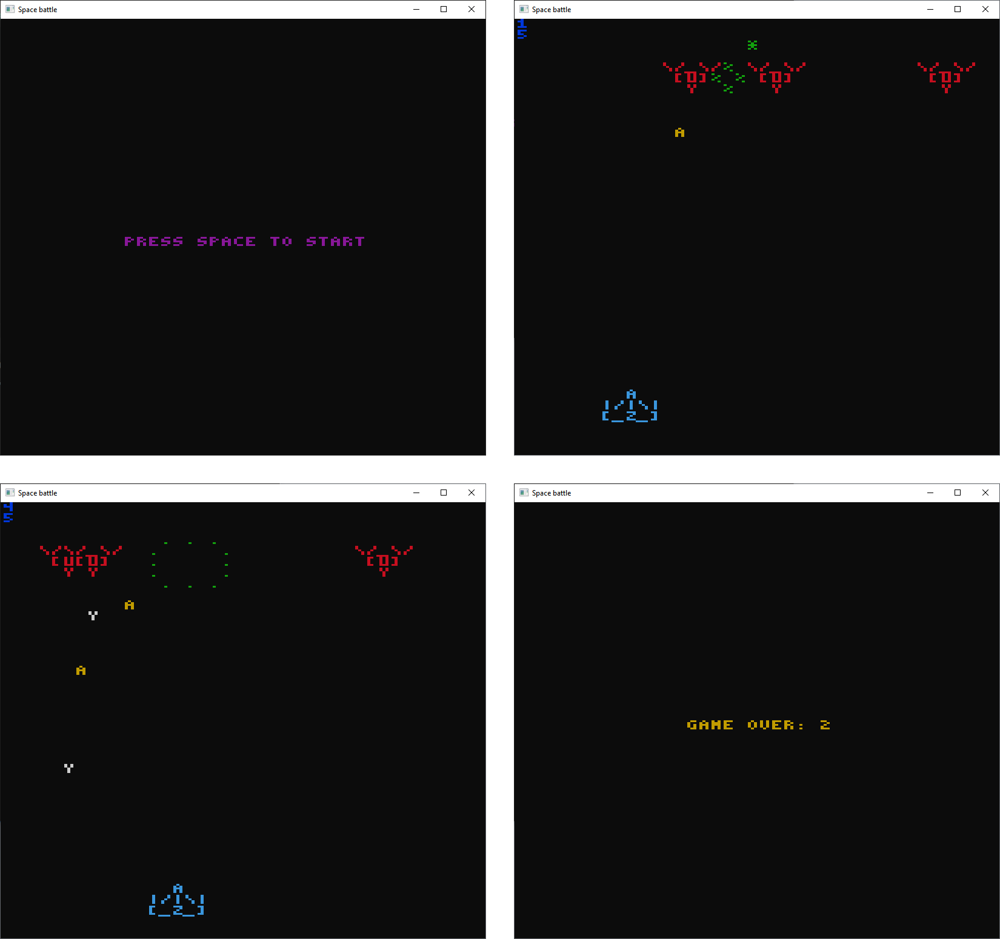

## Space battle console game

Made with [ConsoleGameEngine](https://github.com/ollelogdahl/ConsoleGameEngine),
which is, unfortunately, not maintained anymore. Written in a mixture of OOP and
functional paradigms (with [Honk#](https://github.com/WhiteBlackGoose/HonkSharp) powering
the last one).

### Gallery




### Play

Install [git](https://git-scm.com) and [.NET 5 SDK](https://dotnet.microsoft.com/download/dotnet/5.0) and run: 
```
git clone --recurse-submodules https://github.com/WhiteBlackGoose/FunConsoleGame
cd FunConsoleGame
dotnet restore
dotnet build -c release
cd Sources
dotnet run -c release
```